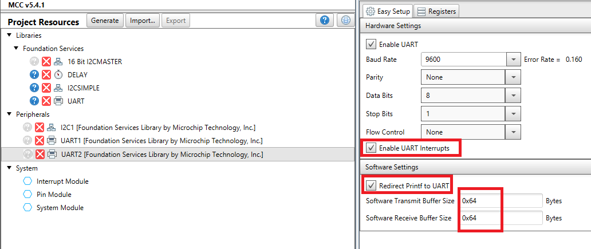
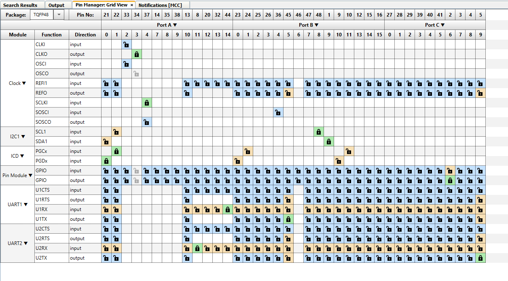
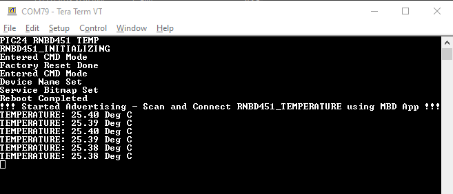

# RNBD451 BLE TEMPERATURE SENSOR

> "IoT Made Easy!" 

Devices: **| RNBD451 |** 
Features: **| BLE | HEART RATE |**

## ⚠ Disclaimer

<b>
THE SOFTWARE ARE PROVIDED "AS IS" AND GIVE A PATH FOR SELF-SUPPORT AND SELF-MAINTENANCE. This repository contains example code intended to help accelerate client product development.  

For additional Microchip repos, see: <a href="https://github.com/Microchip-MPLAB-Harmony" target="_blank">https://github.com/Microchip-MPLAB-Harmony</a>

Checkout the <a href="https://microchipsupport.force.com/s/" target="_blank">Technical support portal</a> to access our knowledge base, community forums or submit support ticket requests.

</b>

## Contents

1. [Introduction](#step1)
1. [Bill of materials](#step2)
1. [Hardware Setup](#step3)
1. [Software Setup](#step4)
1. [Harmony MCC Configuration](#step5)
1. [Board Programming](#step6)
1. [Run the demo](#step7)

## 1. Introduction<a name="step1">

### Getting started with RNBD451 Plug and Temperature Sensor

This application demonstrates how to add the RNBD451 with PIC24 to implement a BLE temperature sensor using TEMP&HUM 13 CLICK. The RN commands are sent from the PIC24FJ64GU205 CURIOSITY NANO BOARD to establish the Temperature sensor application, which can be viewed in the MBD application.

## 2. Bill of materials<a name="step2">

| TOOLS | QUANTITY |
| :- | :- |
| [PIC24FJ64GU205 CURIOSITY NANO DEVELOPMENT BOARD](https://www.microchip.com/en-us/development-tool/ev10k72a) | 1 |
| [CURIOSITY NANO BASE FOR CLICK BOARDS](https://www.microchip.com/en-us/development-tool/ac164162) | 1 |
| [RNBD451 Add-on Board](https://www.microchip.com/en-us/development-tool/ev25f14a) | 1 |
| [TEMP&HUM 13 CLICK](https://www.mikroe.com/temphum-13-click) | 1 |

## 3. Hardware Setup<a name="step3">

- Connect the TEMP&HUM 13 CLICK Board to the Mikro Bus 1 and RNBD451 Add-on Board to the Mikro Bus 2 and connect the PIC24FJ64GU205 CURIOSITY NANO DEVELOPMENT BOARD as shown below.

## 4. Software Setup<a name="step4">

- [MPLAB X IDE ](https://www.microchip.com/en-us/tools-resources/develop/mplab-x-ide#tabs)

    - Version: 6.10
	- XC16 Compiler: v2.00
	- MPLAB® Code Configurator: v5.4.1
	- mcc_core_version: v5.6.1
	- content_manager_version: v4.3.1
	- PIC24F-GP-GU_DFP: v1.1.227
	  
- Any Serial Terminal application like [TERA TERM](https://download.cnet.com/Tera-Term/3000-2094_4-75766675.html) terminal application

- [MPLAB X IPE v6.10](https://microchipdeveloper.com/ipe:installation)

- [Microchip Bluetooth Data (MBD) iOS/Android app](https://play.google.com/store/apps/details?id=com.microchip.bluetooth.data&hl=en_IN&gl=US).

## 5. Harmony MCC Configuration<a name="step5">

### Implementing the RNBD451 with PIC24FJ64GU205.

| Tip | New users of MPLAB Code Configurator are recommended to go through the [overview](https://onlinedocs.microchip.com/pr/GUID-1F7007B8-9A46-4D03-AEED-650357BA760D-en-US-6/index.html?GUID-AFAB9227-B10C-4FAE-9785-98474664B50A) |
| :- | :- |

**Step 1** - Connect the PIC24FJ64GU205 CURIOSITY NANO DEVELOPMENT BOARD to the device/system using a micro-USB cable.

**Step 2** - Open the MPLAB Code Configurator and follow the steps as shown below.

**Step 3** - In Device Resources, go to Libraries->Foundation Services->I2CSIMPLE and add the I2CSIMPLE component to configure as shown below.

**Step 4** - In Project Resources, select the 16 bit I2CMASTER component from Foundation Services and configure as shown below.

**Step 5** - In Project Resources, select the I2C1 component from Peripherals and configure as shown below.

**Step 6** - In Device Resources, go to Libraries->Foundation Services->DELAY and add the DELAY component to configure as shown below.

**Step 7** - In Device Resources, go to Libraries->Foundation Services->UART and add the UART component to configure as shown below.

**Step 8** - In Project Resources, select the UART1 component from Peripherals and configure as shown below.

**Step 9** - In Project Resources, select the UART2 component from Peripherals and configure as shown below.

**Step 10** - In Project Resources, select the Pin Module component from Systems and configure as shown below.

- Refer the PIN Manager : Grid View and configure as shown below.

**Step 11** - [Generate](https://onlinedocs.microchip.com/pr/GUID-A5330D3A-9F51-4A26-B71D-8503A493DF9C-en-US-1/index.html?GUID-9C28F407-4879-4174-9963-2CF34161398E) the code.

**Step 12** - Change the following Code as mentioned below.

- Download this repository and add the Header and Source files from "app_tempHum13" & "rnbd" folders from drivers folder.

- Copy the file [main.c](https://github.com/MicrochipTech/RNBD451_BLE_TEMPERATURE_SENSOR/blob/main/firmware/PIC24_RNBD451_TH.X/main.c) and replace it.
		
	- In this file the RNBD_TempHum_example() function initializes the RNBD451 Module and sends the temperature value to the MBD App.

**Step 13** - Clean and build the project. To run the project, select "Make and program device" button.
	
**Step 14** - The Application Serial logs can be viewed in [TERA TERM](https://download.cnet.com/Tera-Term/3000-2094_4-75766675.html) COM PORT.

	
## 6. Board Programming<a name="step6">

## Programming hex file:

### Program the precompiled hex file using MPLAB X IPE

- The Precompiled hex file is given in the hex folder.

Follow the steps provided in the link to [program the precompiled hex file](https://microchipdeveloper.com/ipe:programming-device) using MPLABX IPE to program the pre-compiled hex image. 

### Build and program the application using MPLAB X IDE

The application folder can be found by navigating to the following path: 

- "firmware/PIC24_RNBD451_TH.X"

Follow the steps provided in the link to [Build and program the application](https://github.com/Microchip-MPLAB-Harmony/wireless_apps_pic32cxbz2_wbz45/tree/master/apps/ble/advanced_applications/ble_sensor#build-and-program-the-application-guid-3d55fb8a-5995-439d-bcd6-deae7e8e78ad-section).

## 7. Run the demo<a name="step7">

- After programming the board, the expected application behavior is shown in the below [video](https://github.com/MicrochipTech/RNBD451_BLE_HEART_RATE_SENSOR/blob/main/docs/demo.gif).

	
